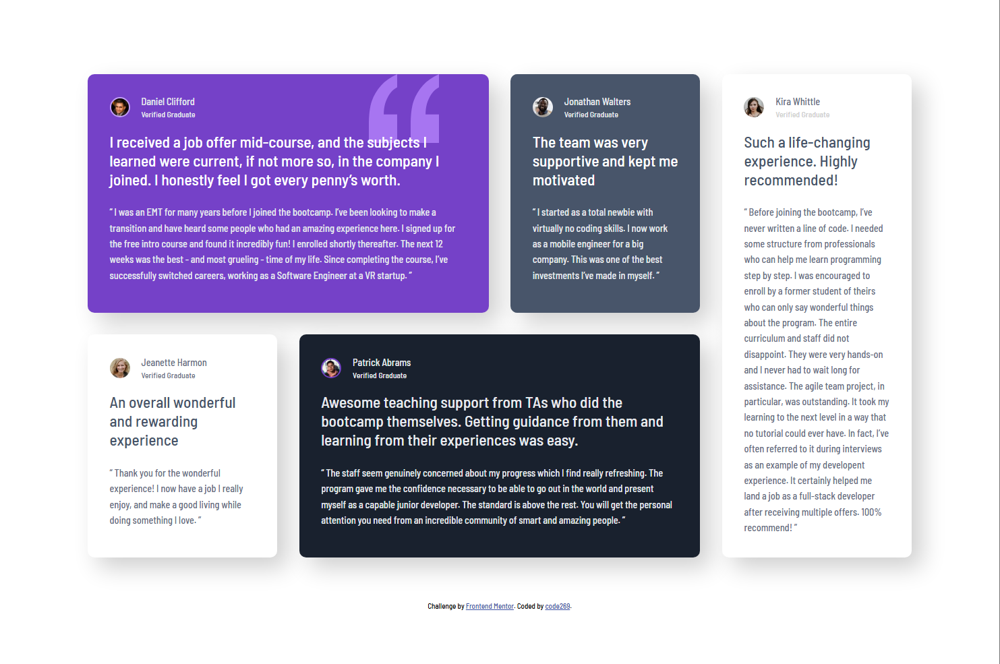

# Frontend Mentor - Testimonials grid section solution

This is a solution to the [Testimonials grid section challenge on Frontend Mentor](https://www.frontendmentor.io/challenges/testimonials-grid-section-Nnw6J7Un7). Frontend Mentor challenges help you improve your coding skills by building realistic projects.

## Table of contents

- [Overview](#overview)
  - [The challenge](#the-challenge)
  - [Screenshot](#screenshot)
  - [Links](#links)
- [Author](#author)

## Overview

### The challenge

Users should be able to:

- View the optimal layout for the site depending on their device's screen size

### Screenshot

Mobile:

Tablet:

Desktop:

### Links

- Solution URL: [GitHub](https://github.com/code269/fem-testimonial-grid)
- Live Site URL: [Deployment](https://code269.github.io/fem-testimonial-grid/)

## Author

- Website - [GitHub - code269](https://github.com/code269)
- Frontend Mentor - [FEM - @code269](https://www.frontendmentor.io/profile/code269)
